# 📄 AWS Document Processing Pipeline — EKS & Event-Driven Autoscaling

An event-driven document processing pipeline built on Amazon EKS. A user uploads a PDF to S3, which fires an SQS message. KEDA (Kubernetes Event Driven Autoscaling) watches queue depth and scales worker pods from 0 to 5 based on demand. A worker pod pulls the message, calls AWS Textract to extract text, tables, and key-value pairs from the document, and writes the results to RDS PostgreSQL. A separate, always-on REST API (Flask) reads from RDS and serves the processed data over JSON — no frontend, API-only by design.

I built this as my first Kubernetes/EKS project to prove out patterns that ECS Fargate can't replicate: pod autoscaling driven directly by an external event source (queue depth, not CPU/memory), and fine-grained per-workload AWS permissions via IRSA rather than one task role per service. Everything scales to zero when idle — no workers running, no compute cost, until a document actually shows up.

---

## 🏗️ Architecture

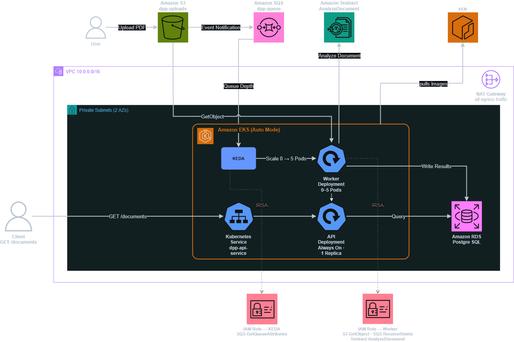

### Why EKS + KEDA over ECS Fargate

My prior container project (ECS Fargate microservices dashboard) runs services that are always on, scaled on CPU/memory thresholds. This pipeline needed something different: idle almost all the time, bursty on demand, and scaling driven by a queue depth metric that has nothing to do with CPU. KEDA is a Kubernetes-native pattern for exactly this — it polls an external metric source (SQS queue depth here) and drives a Horizontal Pod Autoscaler based on it, including scaling to **zero** replicas when the queue is empty. ECS doesn't have an equivalent built-in mechanism; it can be approximated with Lambda-triggered scaling policies, but KEDA's ScaledObject is a first-class, declarative way to express "scale this deployment off of SQS depth" in a few lines of YAML.

### Why EKS Auto Mode over managed node groups

Auto Mode hands node provisioning, scaling, and lifecycle to AWS instead of me managing a node group's launch template, scaling policies, and AMI updates. For a portfolio project the goal is to prove out Kubernetes and EKS fundamentals — IRSA, ScaledObjects, Service/Deployment patterns — not to hand-roll node group operations. It costs slightly more than self-managed nodes but removes an entire category of infrastructure toil that isn't the point of this project.

### IRSA instead of shared IAM roles

Every pod that needs AWS access gets its own IAM role, assumed via its Kubernetes ServiceAccount and the cluster's OIDC identity provider — no static credentials anywhere in a container or Secret. The worker pod's role is scoped to exactly `sqs:ReceiveMessage/DeleteMessage/GetQueueAttributes`, `textract:AnalyzeDocument/DetectDocumentText`, and `s3:GetObject` on the uploads bucket. The KEDA operator gets its **own** separate role, scoped to just `sqs:GetQueueAttributes` — it polls the queue independently of the worker and needs its own identity to do it (see Challenges below).

---

## 🛠️ AWS Services Used

| Service | Purpose |
|---|---|
| **EKS (Auto Mode)** | Managed Kubernetes control plane and node provisioning |
| **KEDA** (via Helm) | Event-driven autoscaling of worker pods based on SQS queue depth |
| **S3** | Landing zone for uploaded PDFs, triggers the pipeline via event notification |
| **SQS** | Decouples upload events from processing; source of the KEDA scaling metric |
| **Textract** | Extracts text, tables, and key-value pairs from documents |
| **RDS (PostgreSQL)** | Stores processed document metadata and extraction results |
| **ECR** | Private container registry for the worker and API images |
| **IAM / IRSA** | Per-ServiceAccount AWS permissions via OIDC federation — no static credentials |
| **VPC** | Public/private subnets across 2 AZs, NAT Gateway for private egress |
| **Terraform** | Full infrastructure as code, modularized per AWS service/concern |
| **GitHub Actions** | OIDC-authenticated CI/CD — builds images, pushes to ECR, rolls deployments |

---

## 🔑 Key Design Decisions

**Kubernetes application resources are not managed by Terraform**

Terraform provisions AWS infrastructure only — the VPC, EKS cluster, RDS instance, ECR repos, SQS/S3, and IAM/IRSA roles. Deployments, Services, and the KEDA ScaledObject are applied directly via `kubectl apply -f k8s/`. This mirrors the separation of concerns from my ECS dashboard project, where Terraform builds infrastructure and a separate deploy step owns the application layer — just expressed through Kubernetes manifests instead of ECS task definitions.

**Standard SQS queue, not FIFO**

Document processing jobs are independent of each other — order doesn't matter, and occasional duplicate processing (if a message is redelivered) is harmless. FIFO would add unnecessary throughput constraints and cost for no benefit here.

**KEDA's own IRSA identity, separate from the worker's**

KEDA needs to poll SQS `GetQueueAttributes` to know the current queue depth, but it does this from the `keda-operator` pod, not from a worker pod. Giving KEDA its own role (rather than trying to reuse the worker's) is what actually made the `identityOwner: keda` TriggerAuthentication pattern work — see Challenges.

**NAT Gateway for egress, no VPC endpoints**

S3, SQS, Textract, and ECR are all public AWS endpoints, so every call from a private-subnet pod egresses through the NAT Gateway. VPC endpoints would keep that traffic off the NAT entirely — the S3 *Gateway* endpoint is free and would be the first thing I'd add in production, since it removes NAT data-processing charges on every PDF download. The other three need *Interface* endpoints at roughly $7–8/month each per AZ, which across 2 AZs costs more than the NAT itself at this traffic volume. Documenting the tradeoff rather than reflexively adding endpoints.

**Hand-written Terraform resources instead of community modules**

I considered `terraform-aws-modules/eks/aws` and similar, but the point of this project was to actually understand EKS's resource model — cluster IAM roles, Auto Mode's `compute_config`, the OIDC provider setup that IRSA depends on. Community modules abstract exactly the parts I wanted to learn. I'd use one on a future project now that the fundamentals are proven here.

---

## 📁 Project Structure

```
aws-document-processing-pipeline/
├── .github/
│   └── workflows/
│       └── deploy-images.yml    # OIDC-authenticated build, push, and rollout
├── infra/
│   ├── main.tf
│   ├── variables.tf
│   ├── outputs.tf
│   ├── backend.tf
│   └── modules/
│       ├── networking/     # VPC, subnets, IGW, NAT Gateway, route tables
│       ├── storage/        # S3 bucket, SQS queue, event notification
│       ├── database/       # RDS PostgreSQL, security group, subnet group
│       ├── ecr/             # Worker and API image repositories
│       ├── eks/              # EKS Auto Mode cluster, cluster/node IAM roles, OIDC provider
│       ├── iam/               # IRSA roles for the worker pod and the KEDA operator
│       └── cicd/               # GitHub Actions OIDC deploy role + EKS access entry
├── k8s/
│   ├── service-accounts.yaml     # IRSA-annotated ServiceAccounts
│   ├── worker-deployment.yaml    # Worker Deployment (replicas: 0, KEDA-controlled)
│   ├── worker-scaledobject.yaml  # KEDA ScaledObject + TriggerAuthentication
│   └── api-deployment.yaml       # Always-on API Deployment + Service
├── services/
│   ├── processor/    # Worker: polls SQS, calls Textract, writes to RDS
│   │   ├── app.py
│   │   ├── requirements.txt
│   │   └── Dockerfile
│   └── api/            # REST API: reads from RDS, serves JSON
│       ├── app.py
│       ├── requirements.txt
│       └── Dockerfile
├── docs/
│   └── architecture.drawio   # editable source for the architecture diagram
├── screenshots/
└── .gitignore
```

---

## 🚀 Deploying

```bash
# 1. Provision infrastructure
cd infra
terraform init
terraform apply          # requires db_password and github_repo in terraform.tfvars

# 2. Grant your IAM principal cluster access (see Challenges — not automatic)
aws eks create-access-entry --cluster-name dpp-cluster --principal-arn <your-iam-arn>
aws eks associate-access-policy --cluster-name dpp-cluster --principal-arn <your-iam-arn> \
  --policy-arn arn:aws:eks::aws:cluster-access-policy/AmazonEKSClusterAdminPolicy \
  --access-scope type=cluster

aws eks update-kubeconfig --region us-west-1 --name dpp-cluster

# 3. Install KEDA, annotated with its own IRSA role
helm repo add kedacore https://kedacore.github.io/charts && helm repo update
helm install keda kedacore/keda --namespace keda --create-namespace \
  --set podIdentity.aws.irsa.enabled=true \
  --set serviceAccount.operator.annotations."eks\.amazonaws\.com/role-arn"="$(terraform -chdir=infra output -raw keda_operator_role_arn)"

# 4. Create the DB secret (never committed — see k8s/worker-deployment.yaml)
kubectl create secret generic dpp-db-secret --from-literal=DB_PASSWORD='<your-db-password>'

# 5. Create the documents table
#    (schema in services/processor — connect via a pod, RDS is private)

# 6. Apply application manifests
kubectl apply -f k8s/
```

Image builds and rollouts are handled by the GitHub Actions pipeline — see CI/CD below.

---

## ✅ Validation — End-to-End Pipeline

A PDF uploaded to S3 flows through the entire pipeline automatically: S3 event → SQS message → KEDA scales the worker deployment up from 0 → Textract extracts text and key-value pairs → results written to RDS → readable via the REST API.

### PDF Upload Triggering the Pipeline
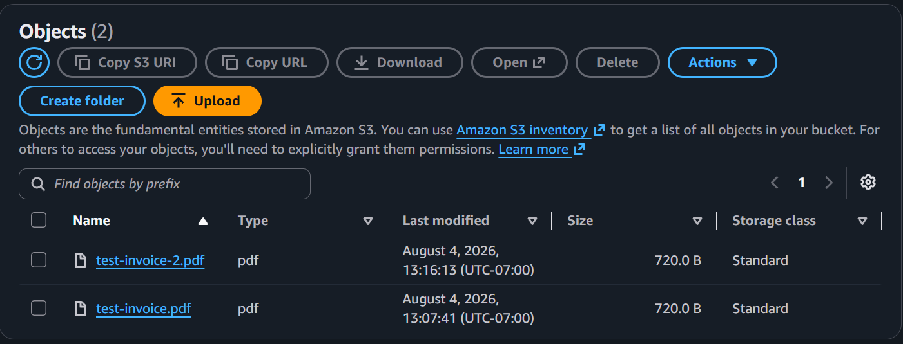

### KEDA Scaling the Worker Deployment 0 → 5
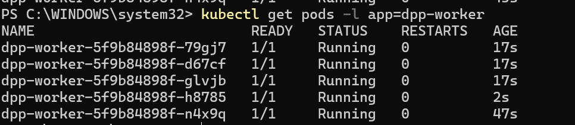

Uploading a batch of documents drives the queue depth up and KEDA scales the worker deployment to its `maxReplicaCount` of 5.

### Worker Logs — Textract Processing
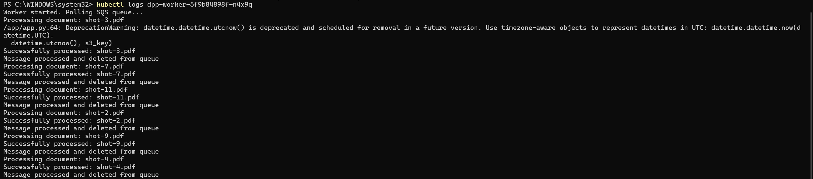

### API Response — Processed Document
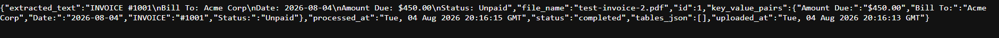

### Worker Scaling Back to 0 After Cooldown
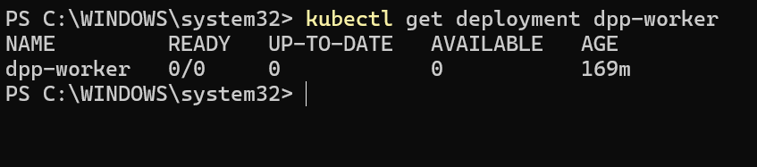

---

## 🌍 Infrastructure

### EKS Cluster
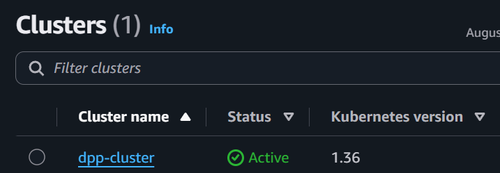

### KEDA ScaledObject
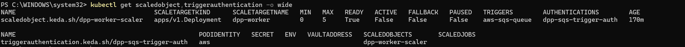

### RDS Instance
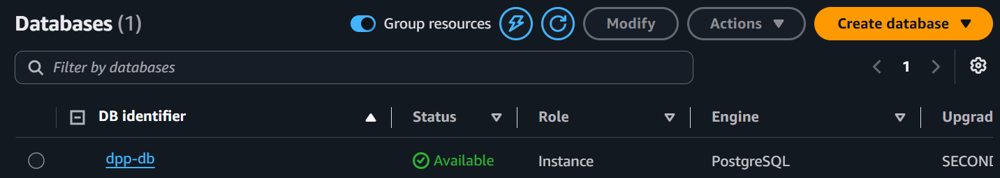

### ECR Repositories
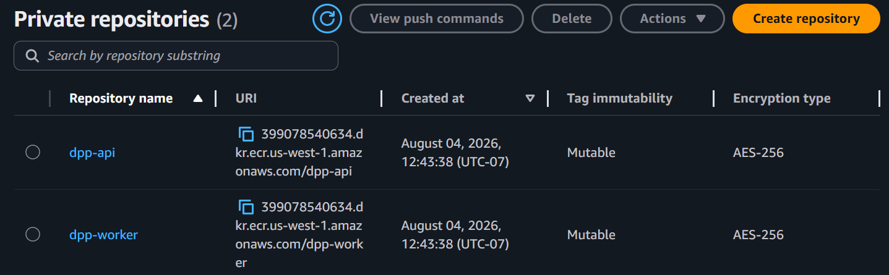

### IAM Roles — IRSA
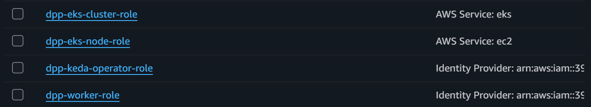

### VPC & Networking
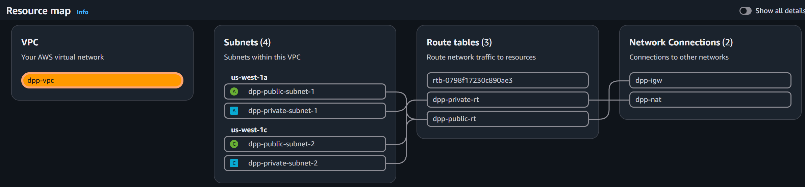

### Terraform — State Matches Configuration
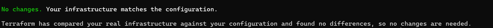

`terraform plan` against the live stack reports no drift — the deployed infrastructure matches what's committed.

---

## ⚙️ CI/CD

`deploy-images.yml` triggers on any push to `services/**`. It builds both container images, pushes them to ECR, and rolls the running deployments — authenticated entirely through GitHub OIDC, with no AWS credentials stored anywhere in the repo.

**How the auth works.** GitHub mints a short-lived OIDC token for the workflow run. AWS trusts that token because the account has GitHub registered as an OIDC identity provider, and the deploy role's trust policy accepts it — but only under a tightly scoped condition:

```hcl
StringLike = {
  "token.actions.githubusercontent.com:sub" = "repo:${var.github_repo}:ref:refs/heads/${var.github_branch}"
}
```

That `sub` condition is the control that matters. Without it, **any** GitHub repository could assume the role. Scoping to one repo and one branch means a fork, a pull request, or another repo in the same org can't deploy.

**Permission scoping.** The deploy role gets `ecr:PutImage` and friends on exactly the two repository ARNs — not `*`. The one unavoidable wildcard is `ecr:GetAuthorizationToken`, which AWS defines as account-wide. For cluster access, `eks:DescribeCluster` only generates a kubeconfig; actual Kubernetes authorization comes from an **EKS access entry** bound to `AmazonEKSEditPolicy` scoped to the `default` namespace — enough to roll a deployment, not enough to touch cluster-scoped resources or reach other namespaces.

**Immutable image tags.** Images are tagged with the commit SHA as well as `latest`, and the rollout uses `kubectl set image` with the SHA. Every deployment therefore points at one exact build, which makes `kubectl rollout undo` meaningful and removes the ambiguity of a moving `latest` tag.

**Why the OIDC provider is a data source, not a resource.** IAM allows only one OIDC provider per URL per account, and it's shared by every project in the account that deploys from GitHub. Managing an account-wide shared resource from one project's state would mean `terraform destroy` here silently breaks every other project's pipeline. The module references it read-only and documents the one-time account-level creation instead.

Terraform itself runs locally — the pipeline owns application deployment only, the same separation of concerns used in my ECS project.

---

## 📚 What I Learned

- IRSA: how EKS clusters act as OIDC identity providers, and how a Kubernetes ServiceAccount annotation lets a pod assume a scoped IAM role with zero static credentials
- KEDA's ScaledObject/TriggerAuthentication pattern for scaling Kubernetes workloads off an external event source, including scale-to-zero
- EKS Auto Mode's Terraform resource model — `compute_config`, `access_config`, the specific IAM policy set Auto Mode requires that a traditional managed node group doesn't
- EKS access entries (API authentication mode) as the modern replacement for the `aws-auth` ConfigMap, and that cluster-creator admin access isn't granted automatically
- Which Terraform attributes force resource replacement vs. update in place — and why reading a plan diff carefully matters more on stateful resources like an EKS cluster than on anything else
- GitHub Actions OIDC federation into AWS, and why the `sub` claim condition is the security boundary that makes it safe
- When *not* to let Terraform manage a resource — account-wide shared resources like an OIDC provider don't belong in a single project's state
- Textract's block-based response format and how to parse it into plain text, tables, and key-value pairs
- Structuring Terraform as real reusable modules with explicit input/output contracts, rather than one flat `main.tf`
- The boundary between what Terraform should own (infrastructure) and what `kubectl` should own (application state) in a Kubernetes-based AWS architecture

---

## 🧩 Challenges

**KEDA's `identityOwner: keda` required `provider: aws`, not `provider: aws-eks`**

KEDA's TriggerAuthentication supports two provider values for pod-identity-based AWS auth. `aws-eks` doesn't actually support the `identityOwner` field — with it set, KEDA tried to STS AssumeRole into the *worker's* IAM role instead of using its own IRSA identity, which failed with AccessDenied since the worker's role has no SQS `GetQueueAttributes` permission scoped for KEDA's use. Switching to `provider: aws` made `identityOwner: keda` take effect correctly, and KEDA started polling successfully using its own dedicated role.

**S3 URL-encodes object keys, breaking `GetObject` calls**

S3 event notifications URL-encode the object key in the SQS message body — spaces become `+`. The worker was reading the raw key without decoding it, so any file with special characters in its name failed with `InvalidS3ObjectException`. Fixed with `urllib.parse.unquote_plus()` on the key before calling `S3.GetObject`.

**Textract's synchronous API only supports single-page PDFs**

`analyze_document` (the sync API) throws `UnsupportedDocumentException` on multi-page documents. The pipeline is currently validated against single-page PDFs only; processing real multi-page documents would require switching to Textract's asynchronous API (`start_document_analysis` / `get_document_analysis`) with polling or an SNS completion callback. Noted as a scoped-out follow-up rather than blocking the core architecture demonstration.

**EKS cluster-creator access isn't automatic under API authentication mode**

With `access_config.authentication_mode = "API"`, I expected the IAM principal running `terraform apply` to automatically get cluster access, the way it does when creating a cluster through the console. It doesn't — the cluster applied cleanly, then every `kubectl` command failed with "the server has asked for the client to provide credentials." Listing access entries confirmed only the EKS service-linked role and the node role were present; my IAM user had none.

The immediate fix was creating one directly:

```bash
aws eks create-access-entry --cluster-name dpp-cluster --principal-arn <my-iam-arn>
aws eks associate-access-policy --cluster-name dpp-cluster --principal-arn <my-iam-arn> \
  --policy-arn arn:aws:eks::aws:cluster-access-policy/AmazonEKSClusterAdminPolicy \
  --access-scope type=cluster
```

The interesting part came next. The obvious "proper" fix is `bootstrap_cluster_creator_admin_permissions = true` in the `access_config` block — but that's a **create-time-only attribute**. Setting it on an already-running cluster makes Terraform plan a full **replacement**: cluster destroyed, OIDC provider destroyed, IRSA roles orphaned. I caught this in a `terraform plan` diff before applying it, which is a good argument for reading plan output line by line rather than skimming for the resource count. The module now documents the post-apply access-entry step in a comment instead, since the flag only helps on a genuinely fresh deploy.

**Worker logs were silently empty — Python stdout buffering**

`kubectl logs` on the worker returned nothing but a deprecation warning, even while documents were provably processing and landing in RDS. Python buffers `stdout` when it isn't attached to a TTY, so every `print()` sat in a buffer that never flushed — the only reason logs appeared earlier in development was that a crash flushed the buffer on the way out. Fixed by setting `PYTHONUNBUFFERED=1` in the worker Deployment. Worth knowing generally: a containerized Python worker that looks silent isn't necessarily idle, and losing logs in a Kubernetes project undercuts the whole observability story.

**`aws_nat_gateway` doesn't take `vpc_id` or an `availability_mode` argument**

An earlier draft of the networking module tried to configure the NAT Gateway as VPC-scoped rather than subnet-scoped, using arguments that don't exist on the resource. NAT gateways provision into a specific subnet — that's what determines their AZ — not the VPC directly. Fixed by pointing `subnet_id` at one of the public subnets.
